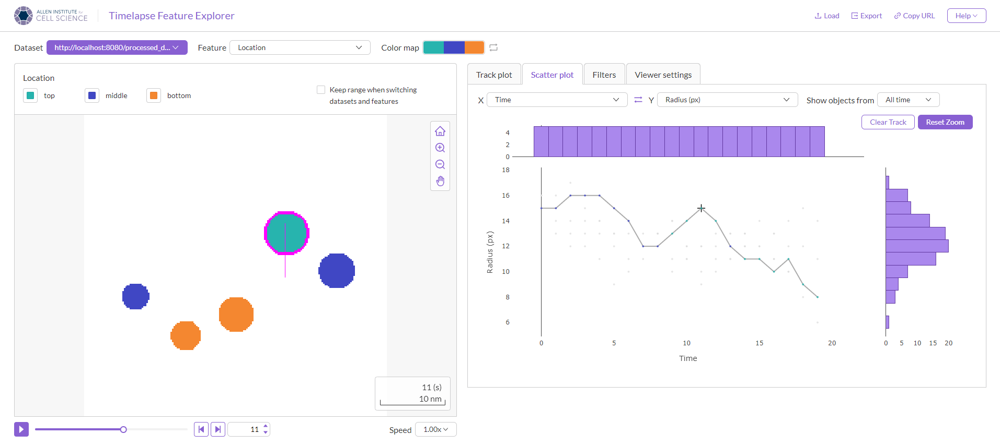

# Getting Started: how to process data for Timelapse Feature Explorer

The [Timelapse Feature Explorer (TFE)](https://timelapse.allencell.org) is a web-based application designed for the interactive visualization and analysis of segmented time-series microscopy data! Data needs to be processed into a specific format to be loaded into the viewer.

In this tutorial, you'll learn how to prepare your data for the Timelapse Feature Explorer.

## 1. Terms

A few key terms:

- **Dataset**: A dataset is a single time-series, and can have any number of tracked objects and features.
- **Raw dataset**: The raw data that you have collected or generated, before processing into the TFE format.
- **Collection**: An arbitrary grouping of datasets.
- **Object ID**: An ID associated with a single segmentation at a single timepoint. In the TFE-accepted format, object IDs must be sequential, starting from 0, and be unique across the whole dataset.
- **Track ID**: An identifier for a unique set of objects, linking their object IDs across timepoints.

## 2. Prerequisites

### Installing `colorizer-data`

From a command terminal, clone this repository and run the following commands to install dependencies. This will install the necessary libraries for the example scripts and the latest release of `colorizer-data`. (You may want to do this from a virtual Python environment-- see [venv](https://docs.python.org/3/library/venv.html) or [conda](https://docs.conda.io/en/latest/) for more information.)

> **_NOTE_**: You must be on Python version 3.9 or above. The installation may fail unexpectedly on older versions of Python.

```bash
git clone https://github.com/allen-cell-animated/colorizer-data.git
cd colorizer-data/documentation/getting_started_guide

python -m pip install -r ./requirements.txt
```

## 3. Expected formats for raw data

For this tutorial, we'll be working with sample data included in the [`getting_started_guide/raw_dataset`](./getting_started_guide/raw_dataset/) directory.

This dataset is a simplified example of raw, pre-processed segmentation data. The data was generated using the [`generate_raw_data.py` script](./getting_started_guide/scripts/generate_data.py), which generates a **CSV file** with columns for object IDs, track IDs, times, centroids, features (volume/height), and paths to the segmentation images. The **segmentation images** are 2D images in the OME-TIFF format, encoding the locations of segmented objects.

Your files may be in a different format or have 3D segmentation images, in which case it will need to be transformed. Generally, we recommend:

1. Save your data as a CSV or other format that can be read into a pandas `DataFrame`.
2. Make every segmented object its own row in the table.
3. Save track ID, time, centroids, and other information as columns.
4. Create columns for any additional features you want to visualize.

### What does the example dataset look like?

Here's a preview of the raw dataset, `data.csv`:

| object_id | track_id | time | centroid_x | centroid_y | area | radius | location | segmentation_path |
| ----------- | ---------- | ------ | ------------ | ------------ | -------- | -------- | ------------------- | --- |
| 1 | 0 | 0 | 33 | 110 | 706.9 | 15 | middle | frame_0.tiff |
| 2 | 1 | 0 | 67 | 100 | 804.2 | 16 | middle | frame_0.tiff |
| 3 | 2 | 0 | 100 | 108 | 804.2 | 16 | middle | frame_0.tiff |
| 4 | 3 | 0 | 133 | 88 | 706.9 | 15 | middle | frame_0.tiff |
| 5 | 4 | 0 | 167 | 101 | 804.2 | 16 | middle | frame_0.tiff |
| 6 | 0 | 1 | 33 | 121 | 530.9 | 13 | bottom | frame_1.tiff |
| 7 | 1 | 1 | 67 | 113 | 804.2 | 16 | middle | frame_1.tiff |
| ... | ... | ... | ... | ... | ... | ... | ... | ... |

Each of the segmentation images is an OME-TIFF image containing the IDs of the segmented objects:

_Frame 0 of the example dataset, as viewed in FIJI. Contrast has been increased for easier viewing._


> **_NOTE:_** Note that `value=0` is used to represent the background in the segmentation images. For simplicity, we recommend starting object IDs at `1` to avoid conflicts with the background value.

## 4. Processing data

Timelapse Feature Explorer reads data in the format specified by the [`DATA_FORMAT`](./documentation/DATA_FORMAT.md) document. We'll use the utilities provided by `colorizer-data` to convert to this format.

### Processing script

Start an interactive Python session. Make sure you are at `./documentation/getting_started_guide/` in the cloned repository.

```bash
# If not already in the `getting_started_guide` directory:
cd /documentation/getting_started_guide/

python
```

Paste the following steps into the terminal. (Alternatively, you can also create a Python script, copy in the code below, and run it. The full script can be found as [`process_data.py` in the `scripts` directory](./getting_started_guide/scripts/process_data.py).)

#### 1. Import dependencies and load the dataset into a pandas DataFrame

```python
from bioio import BioImage
import pandas as pd

from colorizer_data.types import DATETIME_FORMAT
from colorizer_data.utils import (
    remap_segmented_image,
)
from colorizer_data.writer import (
    ColorizerDatasetWriter,
    ColorizerMetadata,
    FeatureInfo,
    FeatureType,
)

# Load the dataset
data: pd.DataFrame = pd.read_csv("raw_dataset/data.csv")
```

#### 2. Configure the writer and data columns

```python
# Define column names
OBJECT_ID_COLUMN = "object_id"
TRACK_ID_COLUMN = "track_id"
TIMES_COLUMN = "time"
SEGMENTED_IMAGE_COLUMN = "segmentation_path"
CENTROIDS_X_COLUMN = "centroid_x"
CENTROIDS_Y_COLUMN = "centroid_y"
AREA_COLUMN = "area"
LOCATION_COLUMN = "location"
RADIUS_COLUMN = "radius"

# Add in a column to act as an index for the dataset.
# This preserves row numbers even when the dataframe is grouped by
# time later.
INDEX_COLUMN = "index"
data = data.reset_index(drop=True)
data[INDEX_COLUMN] = data.index.values

# Create the writer, which we'll be using to save dataset-related files.
output_dir = "."
dataset_name = "processed_dataset"
writer = ColorizerDatasetWriter(output_dir, dataset_name)
```

#### 3. Write the core data

```python
# Turn core data columns into a numpy array, to be saved by the writer.
tracks = data[TRACK_ID_COLUMN].to_numpy()
times = data[TIMES_COLUMN].to_numpy()
centroids_x = data[CENTROIDS_X_COLUMN].to_numpy()
centroids_y = data[CENTROIDS_Y_COLUMN].to_numpy()

writer.write_data(
    tracks=tracks,
    times=times,
    centroids_x=centroids_x,
    centroids_y=centroids_y,
)
```

#### 4. Write the features

Features can be one of three types:

1. **Continuous** features are used for floating-point numbers.
2. **Discrete** features are used for integers.
3. **Categorical** features are used for string-based labels. Note that there can only be a max of 12 categories for a categorical feature.

The `FeatureInfo` class is used to provide metadata about each feature, such as its label, key, type, and units if applicable.

```python
areas = data[AREA_COLUMN].to_numpy()
locations = data[LOCATION_COLUMN].to_numpy()
radii = data[RADIUS_COLUMN].to_numpy()

# Additional metadata can be provided for each feature, which will be shown
# when interacting with it in the viewer.
area_info = FeatureInfo(
    label="Area",
    key="area",
    type=FeatureType.CONTINUOUS,
    unit="px²",
)
radius_info = FeatureInfo(
    label="Radius",
    key="radius",
    # Discrete features are used for integers.
    type=FeatureType.DISCRETE,
    unit="px",
)
location_info = FeatureInfo(
    label="Location",
    key="location",
    # Categorical features are used for string-based labels.
    type=FeatureType.CATEGORICAL,
    # Categories can be auto-detected from the data, or provided manually
    # if you want to preserve a specific order for the labels.
    categories=["top", "middle", "bottom"],
)
writer.write_feature(areas, area_info)
writer.write_feature(radii, radius_info)
writer.write_feature(locations, location_info)
```

#### 5. Write the images

The `ColorizerDatasetWriter` writes images as PNGs with encoded object IDs. You can see more about what this looks like and how it works in our [data format documentation](./DATA_FORMAT.md#5-frames). As previously noted, all object IDs must be unique too, so this next section will perform three tasks:

1. Load in the image data from the segmentation images
2. Remap the object IDs to be unique across all timepoints
3. Write the remapped images using `ColorizerDatasetWriter.write_image()`

```python
# Group data by the timestamp
data_grouped_by_time = data.groupby(TIMES_COLUMN)
frame_paths = []

for frame_num, frame_data in data_grouped_by_time:
    # Get the path to the image and load it.
    frame_path = frame_data.iloc[0][SEGMENTED_IMAGE_COLUMN]
    segmentation_image = BioImage("raw_dataset/" + frame_path).get_image_data(
        "YX", S=0, T=0, C=0
    )
    # NOTE: For datasets with 3D segmentations, you may need to flatten the data into
    # 2D images. Typically, it's simplest to do so with a max projection, but may vary
    # based on your data. Replace the above line with the following:
    #
    # segmentation_image = bioio.BioImage(frame_path).get_image_data("ZYX", S=0, T=0, C=0)
    # segmentation_image = segmentation_image.max(axis=0)
    #
    # Remap the segmented so object IDs are unique across all timepoints.
    (remapped_segmentations, _lut) = remap_segmented_image(
        segmentation_image, frame_data, OBJECT_ID_COLUMN, INDEX_COLUMN
    )
    # Write the new segmentation image.
    frame_prefix = "frame_"
    frame_suffix = ".png"
    writer.write_image(remapped_segmentations, frame_num, frame_prefix, frame_suffix)
    frame_paths.append(frame_prefix + str(frame_num) + frame_suffix)

writer.set_frame_paths(frame_paths)
```

#### 6. Write the dataset and any additional metadata

```python
# Define the metadata for this dataset.
metadata = ColorizerMetadata(
    name="Example dataset",
    description="An example dataset for the Timelapse Feature Explorer.",
    author="Jane Doe et al.",
    dataset_version="v1.0",
    # The width and height of the original segmentations, in any arbitrary units.
    # This will control the scale bar in the viewer.
    frame_width=100,
    frame_height=100,
    frame_units="nm",
    # Time elapsed between each frame capture, in seconds.
    frame_duration_sec=1,
)

# Write the final dataset
writer.write_manifest(metadata=metadata)
```

Once the steps are run, the new dataset will be found in the `processed_dataset` directory.

## 5. Viewing the dataset

Now that the dataset is processed, we can view it in the Timelapse Feature Explorer!

Our public release of Timelapse Feature Explorer is designed to load datasets hosted on a web server. To load **local datasets and files**, you'll need to run a **local instance** of the viewer. We'll cover steps for both options.

### Viewing datasets via the web

> **_NOTE:_** To use a dataset with our public build of Timelapse Feature Explorer, the dataset must be accessible using the HTTPS protocol (e.g., `https://example.com/your-dataset/`). If you need to use HTTP, run a local instance of the viewer.

For this tutorial, you can load a pre-processed example copy of the dataset, which we've hosted on GitHub. You can access it at this URL: [https://raw.githubusercontent.com/allen-cell-animated/colorizer-data/main/documentation/getting_started_guide/processed_dataset](https://raw.githubusercontent.com/allen-cell-animated/colorizer-data/main/documentation/getting_started_guide/processed_dataset)

If you have updated the dataset files or want to use a local dataset, skip to the next section ([Installing Timelapse Feature Explorer locally](#installing-timelapse-feature-explorer-locally)).

#### Opening your dataset

1. Open Timelapse Feature Explorer at [https://timelapse.allencell.org](https://timelapse.allencell.org).

2. Click the **Load** in the header and paste in the following URL: `https://raw.githubusercontent.com/allen-cell-animated/colorizer-data/main/documentation/getting_started_guide/example/processed_dataset/manifest.json`


> **_NOTE:_** You can either provide the URL of the directory containing a `manifest.json` or the full URL path of a `.json` file that follows the [manifest specification](./DATA_FORMAT.md#dataset). We recommend specifying the full URL path that includes the `manifest.json`.

Click **Load** in the popup menu to load the dataset. The viewer should appear with the dataset loaded!

### Installing Timelapse Feature Explorer locally

To view our **locally converted dataset**, we'll also need to run a **local version** of the Timelapse Feature Explorer.

<details>
<summary><b>[Why do we need to run a local instance of the viewer?]</b></summary>

---
The public version of TFE is served over HTTPS, which is a secure protocol. For security reasons, HTTPS pages cannot load HTTP content, which means that the public version of TFE can only access web content hosted on HTTPS.

We can run a local server to serve our local files over HTTP, but we need to also run TFE on HTTP to access them.

---

</details>

#### 1. TFE installation

Install Node (v20 or above) from [nodejs.org](https://nodejs.org/). Once Node is installed, **open a command terminal** in the directory you want to install TFE into. Run the following commands to clone the repository and install the dependencies:

```bash
git clone https://github.com/allen-cell-animated/timelapse-colorizer.git
cd timelapse-colorizer
npm install
npm run start
```

You can now run `npm run start` at anytime to start the viewer. By default, it will be mounted at `http://localhost:5173`.

#### 2. Serving local files

We've provided a simple script to start a local server and serve the processed dataset files. **Open a new command terminal in the `getting_started_guide` directory** and run the following command:

```bash
# Should be inside the getting_started_guide directory
python scripts/run_local_server.py 8080
```

#### 3. View the dataset

Once both steps are done, open your web browser and navigate to [`http://localhost:5173`](http://localhost:5173). Click the **Load** button in the header and paste in the following URL: `http://localhost:8080/processed_dataset`.

Your dataset should appear in the browser and be ready for viewing!



Click on the features dropdown to select a feature to visualize. You can also hover on individual objects to see their feature values.

## 6. What's next?

### Collections

If you have multiple datasets that you want to group together, you can create a **collection**. When loaded in the viewer, collections allows you to switch between any of the included datasets for easier comparison. See the [section on collections in our data format documentation](./DATA_FORMAT.md#collections) for more information.

Also see the `update_collection()` method in the [`utils.py` file](../colorizer_data/utils.py) to create and update collections.

### Advanced dataset conversion

We provide a number of example scripts that perform more advanced data processing tasks, such as:

1. Including bounding box data and outliers
2. Handling 3D segmentation images
3. Parallelizing frame processing
4. Grouping datasets into collections
5. Handling common arguments/options for processing scripts

All of these scripts are available in the [`bin/example_scripts` directory](../colorizer_data/bin/example_scripts/).
